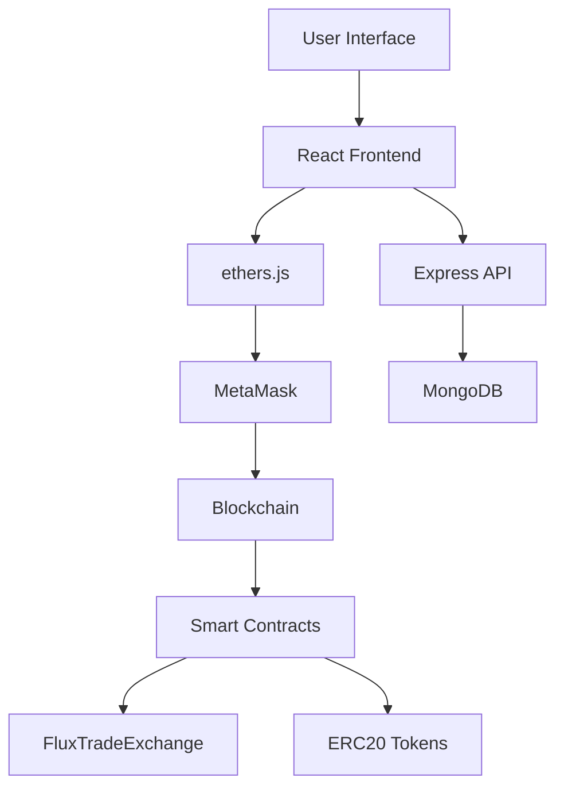

<div align="center">

# ⚡ FluxTrade

### Next-Generation Decentralized Trading Platform

[](https://opensource.org/licenses/MIT)
[](https://reactjs.org/)
[](https://soliditylang.org/)
[](https://hardhat.org/)

<p align="center">
  
  
  
</p>

**A professional-grade decentralized exchange built with cutting-edge Web3 technologies, featuring advanced trading capabilities, seamless wallet integration, and a stunning futuristic UI.**

[Live Demo](#) • [Documentation](#documentation) • [Report Bug](https://github.com/nabin00012/FluxTrade/issues) • [Request Feature](https://github.com/nabin00012/FluxTrade/issues)

</div>

---

## 🌟 Features

<table>
<tr>
<td width="50%">

### 🎨 **Frontend Excellence**
- ⚡ Lightning-fast React 18 + Vite
- 🎨 Stunning Tailwind CSS design
- 🌙 Dark mode with glassmorphism
- 📱 Fully responsive interface
- ✨ Smooth animations & transitions
- 🔐 Secure wallet integration

</td>
<td width="50%">

### ⚙️ **Backend Power**
- 🚀 Scalable Express.js API
- 💾 MongoDB database integration
- 🔒 Advanced security features
- 📊 Real-time data processing
- 🛡️ Rate limiting & protection
- 📡 RESTful API architecture

</td>
</tr>
<tr>
<td width="50%">

### 🔗 **Smart Contracts**
- 📝 Auditable Solidity code
- 🔐 OpenZeppelin standards
- ⚡ Gas-optimized functions
- 🧪 Comprehensive test coverage
- 🎯 Upgradeable architecture
- � ERC-20 token support

</td>
<td width="50%">

### 🎯 **Trading Features**
- 💱 Instant token swaps
- 📈 Real-time price tracking
- 💰 Portfolio management
- 📊 Trade analytics
- 🔄 Multi-token support
- ⚡ Low transaction fees

</td>
</tr>
</table>

---

## 🏗️ Architecture



---

## � Quick Start

### Prerequisites

Ensure you have the following installed:
- Node.js >= 18.0.0
- MongoDB >= 5.0
- MetaMask browser extension

### Installation

```bash
# Clone the repository
git clone https://github.com/nabin00012/FluxTrade.git
cd FluxTrade

# Install all dependencies
npm run install:all
```

### Running Locally

Open 4 terminal windows and run:

**Terminal 1 - Blockchain:**
```bash
cd contracts && npm run node
```

**Terminal 2 - Deploy Contracts:**
```bash
cd contracts && npm run deploy:localhost
```

**Terminal 3 - Backend:**
```bash
cd backend
cp .env.example .env  # Configure MongoDB URI
npm run dev
```

**Terminal 4 - Frontend:**
```bash
cd frontend
cp .env.example .env  # Configure API URL
npm run dev
```

### Access the Application

- **Frontend**: http://localhost:5173
- **Backend API**: http://localhost:5000
- **Blockchain**: http://127.0.0.1:8545

### MetaMask Configuration

```
Network Name: Hardhat Local
RPC URL: http://127.0.0.1:8545
Chain ID: 31337
Currency: ETH
```

---

## 🌐 Deployment

### Deploy Frontend to Vercel

```bash
cd frontend

# Install Vercel CLI
npm i -g vercel

# Deploy
vercel

# Update environment variables in Vercel dashboard:
# VITE_API_URL=https://your-backend.onrender.com/api
# VITE_CHAIN_ID=1 (or your network)
# VITE_CONTRACT_ADDRESS=<deployed_contract_address>
```

### Deploy Backend to Render

1. Create new Web Service on [Render](https://render.com)
2. Connect your GitHub repository
3. Configure:
   ```
   Build Command: cd backend && npm install
   Start Command: cd backend && npm start
   ```
4. Add environment variables:
   ```
   MONGODB_URI=<your_mongodb_atlas_uri>
   NODE_ENV=production
   PORT=5000
   ```

### MongoDB Atlas Setup

1. Create account at [MongoDB Atlas](https://www.mongodb.com/cloud/atlas)
2. Create a new cluster
3. Get connection string
4. Whitelist your IP or use 0.0.0.0/0 for all
5. Update `MONGODB_URI` in backend .env

### Deploy Contracts (Sepolia Testnet)

```bash
cd contracts

# Get Sepolia ETH from faucet
# Configure .env with your private key

npx hardhat run scripts/deploy.js --network sepolia

# Update frontend with new contract address
```

---

## 📁 Project Structure

```
FluxTrade/
├── frontend/                 # React + Vite application
│   ├── src/
│   │   ├── components/      # Reusable UI components
│   │   ├── context/         # React Context (wallet state)
│   │   ├── contracts/       # ABIs and contract addresses
│   │   ├── pages/           # Application pages
│   │   └── App.jsx          # Main application component
│   └── package.json
│
├── backend/                  # Express.js API server
│   ├── config/              # Database configuration
│   ├── controllers/         # Route controllers
│   ├── middleware/          # Custom middleware
│   ├── models/              # MongoDB schemas
│   ├── routes/              # API routes
│   └── server.js            # Server entry point
│
├── contracts/               # Smart contracts & Hardhat
│   ├── contracts/           # Solidity smart contracts
│   ├── scripts/             # Deployment scripts
│   ├── test/                # Contract tests
│   └── hardhat.config.js    # Hardhat configuration
│
└── package.json             # Root package file
```

---

## � Tech Stack

<div align="center">

### Frontend


### Backend


### Blockchain


</div>

---

## 📖 API Documentation

### Trades
- `GET /api/trades` - Get all trades
- `GET /api/trades/:id` - Get trade by ID
- `POST /api/trades` - Create new trade
- `GET /api/trades/user/:address` - Get user trades

### Users
- `GET /api/users/:address` - Get user profile
- `POST /api/users` - Create user
- `PUT /api/users/:address` - Update user
- `GET /api/users/:address/stats` - Get user statistics

### Tokens
- `GET /api/tokens` - Get all tokens
- `GET /api/tokens/:symbol` - Get token by symbol
- `POST /api/tokens` - Add new token
- `PUT /api/tokens/:symbol/price` - Update token price

---

## 🧪 Testing

```bash
# Frontend tests
cd frontend && npm test

# Backend tests
cd backend && npm test

# Smart contract tests
cd contracts && npm test

# Test coverage
cd contracts && npx hardhat coverage
```

---

## 🔒 Security

- ✅ OpenZeppelin security standards
- ✅ ReentrancyGuard protection
- ✅ SafeERC20 implementations
- ✅ Rate limiting on API
- ✅ Input validation
- ✅ Environment variable protection

**Security Audits**: Smart contracts should be audited before mainnet deployment.

---

## 🤝 Contributing

Contributions are welcome! Please feel free to submit a Pull Request.

1. Fork the repository
2. Create your feature branch (`git checkout -b feature/AmazingFeature`)
3. Commit your changes (`git commit -m 'Add some AmazingFeature'`)
4. Push to the branch (`git push origin feature/AmazingFeature`)
5. Open a Pull Request

---

## 📝 License

This project is licensed under the MIT License - see the [LICENSE](LICENSE) file for details.

---

## 🌟 Roadmap

- [ ] Advanced AMM implementation (Uniswap v2/v3 style)
- [ ] Liquidity pool interface
- [ ] Yield farming features
- [ ] Price charts (TradingView integration)
- [ ] Multi-chain support (Polygon, BSC, Arbitrum)
- [ ] Governance token & DAO
- [ ] Mobile app (React Native)
- [ ] Advanced analytics dashboard

---

## 📧 Contact

**Developer**: Nabin Chapagain

**GitHub**: [@nabin00012](https://github.com/nabin00012)

**Project Link**: [https://github.com/nabin00012/FluxTrade](https://github.com/nabin00012/FluxTrade)

---

<div align="center">

### ⭐ Star this repository if you find it helpful!

Made with ❤️ and ☕ by [Nabin Chapagain](https://github.com/nabin00012)

</div>
